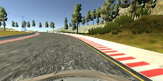
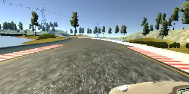

# P3 : Behavioral Cloning

The goal of this project was to train a deep neural network in order to mimic the human driving so that the car
can drive autonomously on the simulator provided by Udacity.

## Dataset
Though the data can be collected by recording the data on the simulator provided by Udacity, I preferred to use the dataset provided by Udacity itself.
Udacity training set is constituted by 8036 samples. For each sample, two main information are provided:

* three frames from the frontal, left and right camera respectively
* the corresponding steering direction

## Data Augmentation
Because 8K samples were not enough to achieve a good performance, data augmentation techniques were applied in order
to get around 25K samples for training. The following augmentation techniques were used:

**Brightness augmentation** : New images were obtained from a single sample by changing the brightness in the HSV
color space.

**Resizing** : The images were resized to (66,220,3) as per the Nvidia's architecture convention.

**Color space** : The color space was changed to YUV from RGB as per the convention of Nvidia's architecture.

**Shift in steering angle** : A shift of 0.25 was added to the steering angel for left images and a shift of -0.25
was added to the steering angle for right images. This was done in order to make sure that the car drives in center of the path.

## Model architecture 
For the purpose of this project [NVIDIA model](https://devblogs.nvidia.com/parallelforall/deep-learning-self-driving-cars/) was chosen. The model was optimized for MSE loss with the help of Adam optimizer.

```python
model = Sequential()
model.add(Lambda(lambda x: x/127.5 - 1., input_shape=(img_rows, img_cols,ch)))

model.add(Convolution2D(24, 5, 5, subsample=(2, 2), border_mode="valid", init="he_normal"))
model.add(Activation('relu'))

model.add(Convolution2D(36, 5, 5, subsample=(2, 2), border_mode="valid", init="he_normal"))
model.add(Activation('relu'))

model.add(Convolution2D(48, 5, 5, subsample=(2, 2), border_mode="valid", init="he_normal"))
model.add(Activation('relu'))

model.add(Convolution2D(64, 3, 3, subsample=(1, 1), border_mode="valid", init="he_normal"))
model.add(Activation('relu'))

model.add(Convolution2D(64, 3, 3, subsample=(1, 1), border_mode="valid", init="he_normal"))
model.add(Activation('relu'))

model.add(Flatten())

#model.add(Activation('relu'))

model.add(Dense(100,init="he_normal"))
model.add(Activation('relu'))
model.add(Dropout(0.5))

model.add(Dense(50,init="he_normal"))
model.add(Activation('relu'))
model.add(Dropout(0.5))

model.add(Dense(10,init="he_normal"))
model.add(Activation('relu'))
model.add(Dense(1))
model.compile(loss="mse", optimizer='adam')

```

## Training
The model was trained and tested on Udacity's dataset. In order to achieve the best performance, different hyperparameters were tuned. The following parameters were found to be the best at the time of training:

* Learning rate in Adam (0.001): Though a slower learning rate is usually preferred in deep learning models but making it too low can increase the amount og training time as low learning rate usually requires larger number of epochs. For training the model, a learning rate of 0.001  

* Batch size : A batch size of 32 was chosen during training time, though this can be varied depending upon the amount of GPU memory available.

* Number of epochs : The model was trained on different number of epochs ([2, 3, 5, 7, 8, 10, 15, 20, 25]), and it was found that 20 epochs give the best performance in this case. Increasing number of epochs beyond 20 doesn't give much improvement in the MSE , especially validation loss. The validation loss after 20 epochs was found to be around 0.210

## Recovery 
There were many points on the track where the car found it too difficult to be on the track. One such point is near the bridge. Here, the car seemed to go off the road. In order to deal with the problem, data was collected by starting from such points and driving towards the middle of road. The model was trained again and again until the car finally learned to drive well at such points. Some of the visualizations of such points are shown below:








## Software Requirements
For running this project successfully, you need to install the following:
* python3.5
* numpy
* scipy
* PIL
* matplotlib
* eventlet
* socketio
* Keras
* tensorflow
* pandas
* scikit-learn
* openCV
* h5py


## Running the model
In order to run the project, you need to run the following command:
  ``` 
    python drive.py model.json

  ```  
