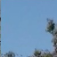

## SDCND P5 : Vehicle Detection and Tracking

---

The goals / steps of this project are the following:

* Perform a Histogram of Oriented Gradients (HOG) feature extraction on a labeled training set of images and train a classifier Linear SVM classifier
* Optionally, you can also apply a color transform and append binned color features, as well as histograms of color, to your HOG feature vector. 
* Note: for those first two steps don't forget to normalize your features and randomize a selection for training and testing.
* Implement a sliding-window technique and use your trained classifier to search for vehicles in images.
* Run your pipeline on a video stream (start with the test_video.mp4 and later implement on full project_video.mp4) and create a heat map of recurring detections frame by frame to reject outliers and follow detected vehicles.
* Estimate a bounding box for vehicles detected.


## [Rubric](https://review.udacity.com/#!/rubrics/513/view) Points
### Here I will consider the rubric points individually and describe how I addressed each point in my implementation.  

---
### Writeup / README

#### 1. Provide a Writeup / README that includes all the rubric points and how you addressed each one.  You can submit your writeup as markdown or pdf.  [Here](https://github.com/udacity/CarND-Vehicle-Detection/blob/master/writeup_template.md) is a template writeup for this project you can use as a guide and a starting point.  

You're reading it!

### Histogram of Oriented Gradients (HOG)

#### 1. Explain how (and identify where in your code) you extracted HOG features from the training images.
The training images consists of two classes namely, `vehicles` and `non-vehicles`. The `vehicles` images consists of the images represting a car while the `non-vehicle` images consists of the images which are not cars. An example of `vehicle` and `non-vehicle` images is shown below:

   

In order to get the HOG of the images, I used the `skimage` `hog()` method. The `hog` method takes up a number of arguments like 'orientations', `pixels_per_cell`, etc. After playing around with the parameters for a while, I found the following values for my model to be the best : `orientations = 9`, 'pixels_per_cell = 8', `cells_per_block = 2`. Also, the images were converted into HSV color space as it was found that among the various color spaces like HSV, BGR, YCrCb, etc, HSV worked best for my pipeline and the hog was collected for all the channels in the image.
The code for generating the hog can be found in the `Vehicle_detection.py` files in the lines (63-76). It is also shown below:

```python
# Define a function to compute and return HOG features
def get_hog_features(img, orient, pix_per_cell, cell_per_block, vis=False, feature_vec=False):
    if vis == True:
        features, hog_image = hog(img, orientations=orient, 
                                       pixels_per_cell=(pix_per_cell, pix_per_cell),
                                       cells_per_block=(cell_per_block, cell_per_block),
                                       transform_sqrt=True, visualise=vis, feature_vector=feature_vec)
        return features, hog_image
    else:
        features = hog(img, orientations=orient, 
                            pixels_per_cell=(pix_per_cell, pix_per_cell),
                            cells_per_block=(cell_per_block, cell_per_block),
                            transform_sqrt=True, visualise=vis, feature_vector=feature_vec)
        return features
```

Here are some images that shows the output of hog calculated for car image in HSV color space.

 
 


And for the no car images, the hog are shown below:

 
 


#### 2. Explain how you settled on your final choice of HOG parameters.
The `hog` method takes up a number of arguments like 'orientations', `pixels_per_cell`, etc. After playing around with the parameters for a while, I found the following values for my model to be the best : `orientations = 9`, 'pixels_per_cell = 8', `cells_per_block = 2`. Also, the images were converted into HSV color space as it was found that among the various color spaces like HSV, BGR, YCrCb, etc, HSV worked best for my pipeline and the hog was collected for all the channels in the image.


#### 3. Describe how (and identify where in your code) you trained a classifier using your selected HOG features (and color features if you used them).
In order to train a classifier, we need to extract the features of vehicles as well as non-vehicles images. Along with HOG features, I used color histograms and spatial binned features in order to provide a rich set of features to the classifier. 
One of the biggest challenges for training the classifier was to separate the images for training and validation sets. The dataset provided was a time-series based and sorting the images for a robust classifier was required. I used `natsort` library for sorting the time series images and separating them into training and validation sets. The code for the same can be found in the lines(246-287) in `Vehicle_detection.py` file and is shown below:

```python
# Load the dataset containing images of vehicles and non-vehicles
def load_data():
    car_images = glob.glob('./Dataset/vehicles/**/*.png', recursive=True)
    nocar_images = glob.glob('./Dataset/non-vehicles/**/*.png', recursive=True)

    x_train = []
    x_valid = []
    y_train = []
    y_valid = []

    # Do train/validation split _properly_
    for target, dataset in enumerate([nocar_images, car_images]):
        folders = list(set(['/'.join(f.split('/')[:-1]) for f in dataset])) # Get unique folders
        print(folders)
        for folder in folders:
            # Sort each folder by time series
            folder_files = natsorted([f for f in dataset if folder in f])
            # Split into train and validation
            folder_files_train = folder_files[:int(len(folder_files) * 0.75)]
            folder_files_valid = folder_files[int(len(folder_files) * 0.75):]

            print('Loading ({}) {} - {} train {} valid'.format(target, folder, len(folder_files_train), 
                                                               len(folder_files_valid)))

            folder_imgs_train = [cv2.imread(f) for f in folder_files_train]
            folder_imgs_valid = [cv2.imread(f) for f in folder_files_valid]
            
           
            x_train.extend(folder_imgs_train)
            x_valid.extend(folder_imgs_valid)
            y_train.extend([target for _ in folder_files_train])
            y_valid.extend([target for _ in folder_files_valid])

    x_train = np.array(x_train)   
    y_train = np.array(y_train) 
    x_valid = np.array(x_valid) 
    y_valid = np.array(y_valid) 

    print("Shape of train data : ", x_train.shape, y_train.shape)
    print("Shape of validation data : ", x_valid.shape, y_valid.shape)
    
    return x_train, y_train, x_valid, y_valid
```

After getting the train and validation sets, all we require was to extract the various features(color_histograms based features, hog, spatial_binning). The code for the same is shown below and can be found in the lines(321-329) in `Vehicle_detection.py` file.

```python
# Extract features for train and validation sets
xtrain = np.array([extract_features(img,color_space='HSV',orient=9,cell_per_block=2,pix_per_cell=8,hist_bins=32,
            hist_range=(0,256),hist_feat=True,hog_channel='ALL',hog_feat=True,spatial_feat=True) for img in x_train])

xvalid = np.array([extract_features(img,color_space='HSV',orient=9,cell_per_block=2,pix_per_cell=8,hist_bins=32,
            hist_range=(0,256),hist_feat=True,hog_channel='ALL',hog_feat=True,spatial_feat=True) for img in x_valid])
```

The `extract_features` function extract different features and the code for the same is shown below.
Lines(129-174) in `Vehicle_detection.py` file

```python
# Define a function to extract features from the images
def extract_features(img, color_space='BGR', spatial_size=(32,32), hist_bins=32, hist_range=(0,256),orient=9, 
                pix_per_cell=8, cell_per_block=2, hog_channel='ALL',spatial_feat=True, hist_feat=True, hog_feat=True):
    
    if img.shape != (64,64,3):
        img = cv2.resize(img, (64,64))

    # Create a list to append features
    features = []
    cspace = color_space

    if color_space != 'BGR':
        if color_space == 'HSV':
            feature_img = cv2.cvtColor(img, cv2.COLOR_BGR2HSV)
        if color_space == 'YCrCb':
            feature_img = cv2.cvtColor(img, cv2.COLOR_BGR2YCrCb)
        if color_space == 'HLS':
            feature_img = cv2.cvtColor(img, cv2.COLOR_BGR2HLS)     
    else:
        feature_img = np.copy(img)
    
    feature_img = feature_img.astype(np.float32)/255 
    #print(np.min(feature_img), np.max(feature_img))
        
    # Compute spatial features if set to true
    if spatial_feat == True:
        spatial_features = bin_spatial(feature_img, color_space=cspace, size=spatial_size)
        features.append(spatial_features)
    
    # Compute histogram features if set to true
    if color_hist == True:
        color_features = color_hist(feature_img, nbins=hist_bins, bins_range=hist_range)
        features.append(color_features)
    
    # Compute hog features if set to true
    if hog_feat == True:
        if hog_channel == 'ALL':
            hog_features= []
            for i in range(feature_img.shape[2]):
                hog_features.extend(get_hog_features(feature_img[:,:,i], orient, pix_per_cell, cell_per_block, feature_vec=True ))
        else:
            hog_features = get_hog_features(feature_img[:,:,hog_channel], orient, pix_per_cell, cell_per_block, feature_vec=True)
        features.append(hog_features)
    
    # return a concatenated list of features
    return np.concatenate((features))       

```                 

Now, all we needed a classifier for classifying the vehicles and non-vehicles images. I used the `LinearSVC` as my main classisifer. The code for instantiating and running a classifier is shown below:
Lines(291-313) in `Vehicles_detection.py` file.

```python
# Run a classifier 
def run_classifier(xtrain, ytrain, xvalid, yvalid):
    # Standardise the dataset
    scaler = StandardScaler()
    # Fit the scaler on the training data
    scaler = scaler.fit(xtrain)
    # Transform xtrain and xvalid datasets
    xtrain = scaler.transform(xtrain)
    xvalid = scaler.transform(xvalid)
    
    # Create an instance of the classisifer
    clf = LinearSVC(C=0.1, penalty='l2', random_state=111)
    #clf = RandomForestClassifier(max_depth=6, n_estimators=100,min_samples_split=2, oob_score=True, random_state=111)
    clf.fit(xtrain, ytrain)
    
    # Check training and validation accuracy
    ptrain = clf.predict(xtrain)
    pvalid = clf.predict(xvalid)
    print("Training accuracy : ", (ptrain == ytrain).mean())
    print("Validation accuracy : ", (pvalid == yvalid).mean())
    
    #return the classifier and the scaler
    return clf, scaler
```
The classifier reported an accuracy of 98% on the validation set, though this can be improved further by using a powerful classifier like `Xgboost`


### Sliding Window Search

#### 1. Describe how (and identify where in your code) you implemented a sliding window search.  How did you decide what scales to search and how much to overlap windows?

The code for sliding window is shown below and can be found in the lines(81-114) in `Vehicle_detection.py` file.
```python
# Define a function for doing sliding window
def slide_window(img, x_start_stop=[None, None], y_start_stop=[None,None], xy_window=(96,96), xy_overlap=(0.75,0.75)):
    if x_start_stop[0] == None:
        x_start_stop[0] = 0
    if x_start_stop[1] == None:
        x_start_stop[1] = img.shape[1]
    if y_start_stop[0] == None:
        y_start_stop[0] = 0
    if y_start_stop[1] == None:
        y_start_stop[1] = img.shape[0]
        
    # Compute the span of the region to be searched 
    xspan = x_start_stop[1] - x_start_stop[0]
    yspan = y_start_stop[1] - y_start_stop[0]
    # Compute the number of pixels per step
    nx_pix_per_step = np.int(xy_window[0]*(1 - xy_overlap[0]))
    ny_pix_per_step = np.int(xy_window[1]*(1 - xy_overlap[1]))
    # Compute the number of sliding windows
    nx_windows = np.int(xspan / nx_pix_per_step)
    ny_windows = np.int(yspan / ny_pix_per_step)
    
    # Initialize an empty list for appending windows
    windows_list = []
    # Loop through the number of windows in x and y directions
    for y_window in range(ny_windows):
        for x_window in range(nx_windows):
            start_x = x_window*nx_pix_per_step + x_start_stop[0]
            end_x = start_x + xy_window[0]
            start_y = y_window*ny_pix_per_step + y_start_stop[0]
            end_y = start_y + xy_window[1]
            
            windows_list.append(((start_x, start_y), (end_x, end_y)))
    
    return windows_list

```
I played a bit with this code for choosing the `y_start_stop` and after experimenting with different search spaces, I settled for the search space with the following values `y_start_stop = [350,600]`. For choosing the size of windows, I played the following values `64, 96, 128` and in my case, I found out that a size of 96 works better. Also, for the overlapping of windows, I tried different values like `0.5, 0.7, 0.75, 0.8` and in the end settled for a value of 0.75 for overlapping. The final parameters for the sliding window were as follows :
`x_start_stop = [0, img.shape[1]]`, `y_start_stop = [350,600]`, `xy_window = (96,96)`, `xy_overlap = (0.75,0.75)`


#### 2. Show some examples of test images to demonstrate how your pipeline is working.  What did you do to optimize the performance of your classifier?

Ultimately I searched using HSV 3-channel HOG features plus spatially binned color and histograms of color in the feature vector, which provided a nice result.  Here are some example images:

 
 

---  


## Video Implementation

#### 1. Provide a link to your final video output.  Your pipeline should perform reasonably well on the entire project video (somewhat wobbly or unstable bounding boxes are ok as long as you are identifying the vehicles most of the time with minimal false positives.)
Here's a [link to my video result](./processed_project_video.mp4)


#### 2. Describe how (and identify where in your code) you implemented some kind of filter for false positives and some method for combining overlapping bounding boxes.

I recorded the positions of positive detections in each frame of the video.  From the positive detections I created a heatmap and then thresholded that map to identify vehicle positions.  I then used `scipy.ndimage.measurements.label()` to identify individual blobs in the heatmap.  I then assumed each blob corresponded to a vehicle.  I constructed bounding boxes to cover the area of each blob detected.  In order to make the pipeline more robust, I played with the `decision_function` method of the LinearSVC classidier. After threshoolding it for different values, I found that a threshold of 0.65 works best for my pipeline. The code for the whole procedure can be found in the lines(179-241) in `Vehicle_detection.py` file. It is as follows:

```python
def search_windows(img, windows, clf, scaler, color_space='BGR',spatial_size=(16, 16), hist_bins=16,
                   orient=9,pix_per_cell=8, cell_per_block=2, hog_channel='ALL', spatial_feat=True,
                   hist_feat=True, hog_feat=True):
    # 1) Create an empty list to receive positive detection windows
    on_windows = []
    # 2) Iterate over all windows in the list
    for window in windows:
        # 3) Extract the test window from original image
        test_img = cv2.resize(img[window[0][1]:window[1][1], window[0][0]:window[1][0]], (64, 64))
        #print(test_img.shape)
        # 4) Extract features
        features = extract_features(test_img,color_space=color_space, orient=orient, spatial_size=spatial_size, hist_bins=hist_bins,
                                             pix_per_cell=pix_per_cell, cell_per_block=cell_per_block,
                                            spatial_feat=spatial_feat, hist_feat=hog_feat, hog_feat=hist_feat, hog_channel=hog_channel)

        #print(features.shape)
        test_features = scaler.transform(np.array(features).reshape(1, -1))
        # 5) Predict using your classifier
        prediction = clf.predict(test_features)
        # 6) If positive (prediction == 1) then save the window
        # if prediction == 1:
        if clf.decision_function(test_features) >=0.65 and prediction ==1:
            on_windows.append(window)
    # 7) Return windows for positive detections
    return on_windows


# Define a function to produce heatmap
def add_heatmap(hmap, bboxes):
    for box in bboxes:
        hmap[box[0][1]:box[1][1], box[0][0]:box[1][0]] += 1
    return hmap    


# Apply thresholding to the heatmap 
def apply_threshold(heatmap, threshold):
    # Zero out pixels below the threshold
    heatmap[heatmap <= threshold] = 0
    # Return thresholded map
    return heatmap


# Define a function to draw labeled boxes
def draw_labeled_bboxes(img, labels):
    # Iterate through all detected cars
    for car_number in range(1, labels[1]+1):
        # Find pixels with each car_number label value
        nonzero = (labels[0] == car_number).nonzero()
        # Identify x and y values of those pixels
        nonzeroy = np.array(nonzero[0])
        nonzerox = np.array(nonzero[1])
        # Define a bounding box based on min/max x and y
        bbox = ((np.min(nonzerox), np.min(nonzeroy)), (np.max(nonzerox), np.max(nonzeroy)))
        # Draw the box on the image
        cv2.rectangle(img, bbox[0], bbox[1], (0,255,0), 6)
    # Return the image
    return img

```
### Here are some test frames and their corresponding heatmaps and bounded boxes:

 
 


 
 


 
 


---


### Discussion

#### 1. Briefly discuss any problems / issues you faced in your implementation of this project.  Where will your pipeline likely fail?  What could you do to make it more robust?

Here I'll talk about the approach I took, what techniques I used, what worked and why, where the pipeline might fail and how I might improve it if I were going to pursue this project further.  


* First, I tried to extract only HOG features but the results were not that good. Then, I tried combining HOG features along with color histograms and spatial binning and finally the combination of three worked very well
* Though I have used a LinearSVC classifier for my pipeline, but in my opinion, a more powerful algorithm like xgboost would have performed better providing greater accuracy and less overfitting. The flase positives detected in the pipeline is mainly because of the classifier issues.
* Right now my pipeline reports more flase positive whenever it encounters a shadow in a frame. Hence in low light or conditions or during night time, it might happen that we might get a lot of flase positives
* My pipeline is likely to fail in rainy conditions too
