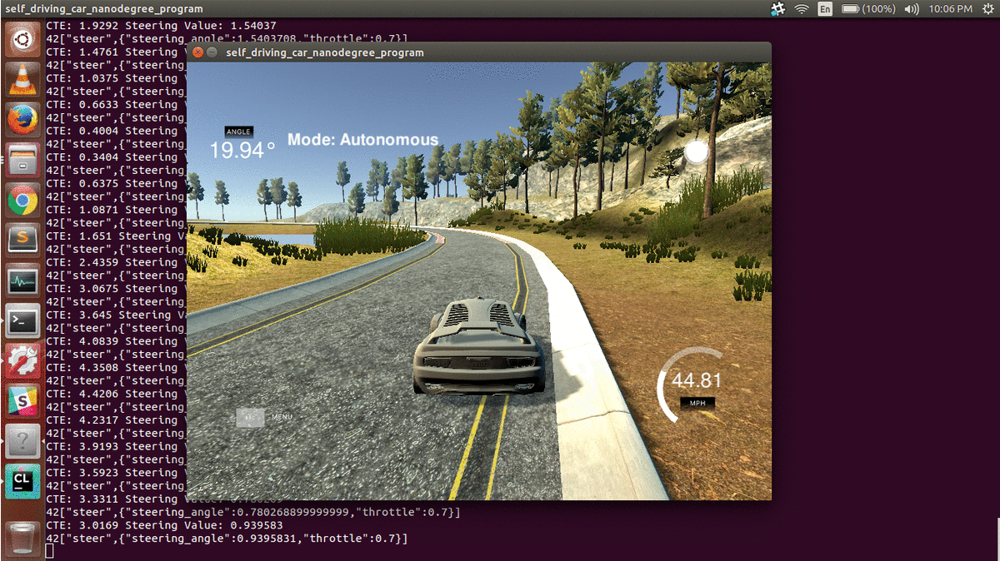
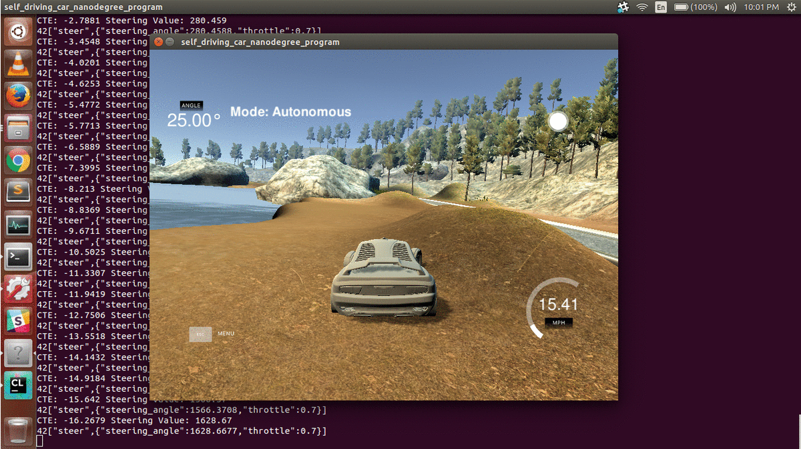
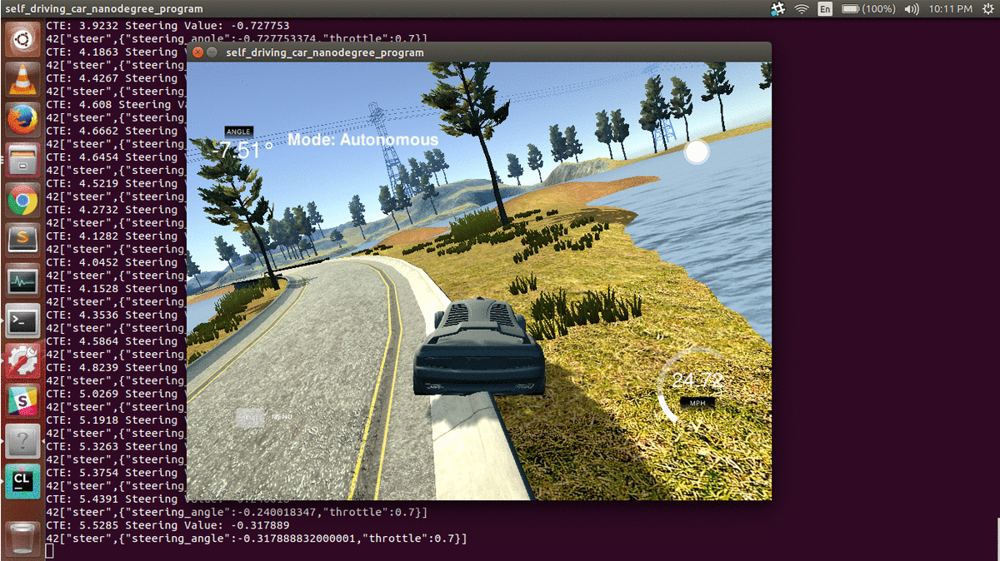
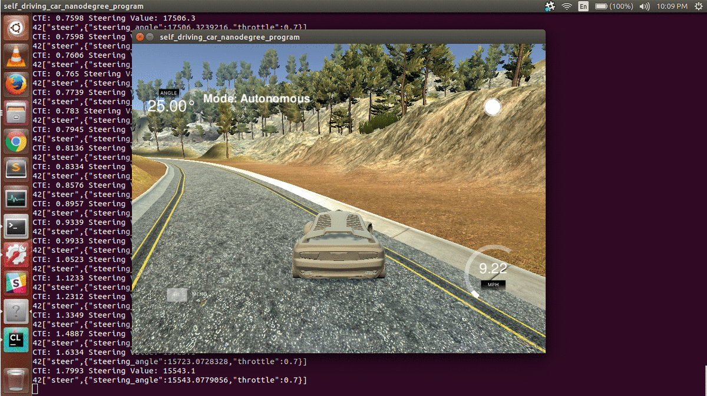
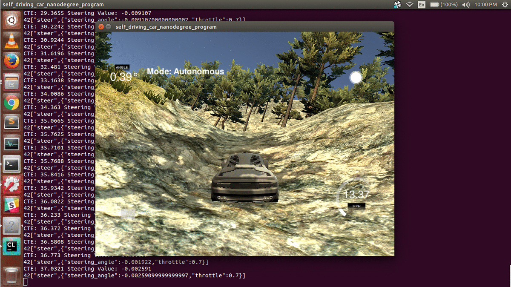
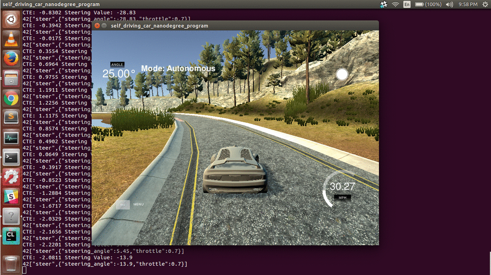

# CarND-Controls-PID
Self-Driving Car Engineer Nanodegree Program

---

## Dependencies

* cmake >= 3.5
 * All OSes: [click here for installation instructions](https://cmake.org/install/)
* make >= 4.1
  * Linux: make is installed by default on most Linux distros
  * Mac: [install Xcode command line tools to get make](https://developer.apple.com/xcode/features/)
  * Windows: [Click here for installation instructions](http://gnuwin32.sourceforge.net/packages/make.htm)
* gcc/g++ >= 5.4
  * Linux: gcc / g++ is installed by default on most Linux distros
  * Mac: same deal as make - [install Xcode command line tools]((https://developer.apple.com/xcode/features/)
  * Windows: recommend using [MinGW](http://www.mingw.org/)
* [uWebSockets](https://github.com/uWebSockets/uWebSockets) == 0.13, but the master branch will probably work just fine
  * Follow the instructions in the [uWebSockets README](https://github.com/uWebSockets/uWebSockets/blob/master/README.md) to get setup for your platform. You can download the zip of the appropriate version from the [releases page](https://github.com/uWebSockets/uWebSockets/releases). Here's a link to the [v0.13 zip](https://github.com/uWebSockets/uWebSockets/archive/v0.13.0.zip).
  * If you run OSX and have homebrew installed you can just run the ./install-mac.sh script to install this
* Simulator. You can download these from the [project intro page](https://github.com/udacity/CarND-PID-Control-Project/releases) in the classroom.

## Basic Build Instructions

1. Clone this repo.
2. Make a build directory: `mkdir build && cd build`
3. Compile: `cmake .. && make`
4. Run it: `./pid`. 

---

## Reflection
In this project, one of the main tasks was to tune the hyperparameters, namely P, I and D, in order to drive the car successfully around the track. I will discuss the effect of each of the component in detail.

### Effect of P:
`P` is known as the proportional term. When `P` is set to very high values, the car oscillates too much and overshoots. If `P` is set to very low values, the car becomes less responsive. For example, it almost touches the boundary at turns when `P` is too low.

|Low P (0.0001)                                  |  High P (100.0) |
|:-------------------------------------------------------:|:-------------------------------------------------------:|
| |  |

---

### Effect of I:
`I` stands for the integral term. It is proportional to the total error accumulated over time. If `I` is too high, then the car oscillates too much. When `I` is too low, it doesn't help to correct the bias of the car (bias can be like drifitng continuously towards left or right).

|Low I (0.00001)                                  |  High I (100.0) |
|:-------------------------------------------------------:|:-------------------------------------------------------:|
| |  |

---

### Effect of D:
`D` stands for the differential term and is proportional to the derivative of error. A proper value of `D` prevents the car from oscillating and overshooting. If `D` is too high, the car oscillates too much. If `D` is too low, then it fails to compensate the effect of `P` and the car become biased and overshoots.

|Low D (0.00001)                                  |  High D (100.0) |
|:-------------------------------------------------------:|:-------------------------------------------------------:|
| |  |

---

## Tuning of PID:
The parameters were tuned manually, although this can be achieved even by using algorithms like `twiddle` or `sgd`. The parameetrs were tested on throttle varying from `0.3` to `0.45`. At `0.3`, the car drives perfectly around the track while at `0.45`, some wobbling was noticed. Following steps were taken to tune the parameters:
**1)** Start with D, keeping P and I constant. Check for some high and some low values. At a value of 5, it was seen that the oscialltions are quiet low.
**2)** After getting a reasonable value for D, start with P keeping D and I constant. Check the effects on too high and too values. It was noted that for a vlaue of 0.08 for P, the car is well resposnive.
**3)** Keep P and D constant and tune I. Again, check for too high and too low values. It was found that for a value of 0.001 for I, everything worked fine.

After getting reasonable values for each of the parameter, further tuning was done and the following values worked very well.
`P = 0.2, I=0.001, D=2.0`

